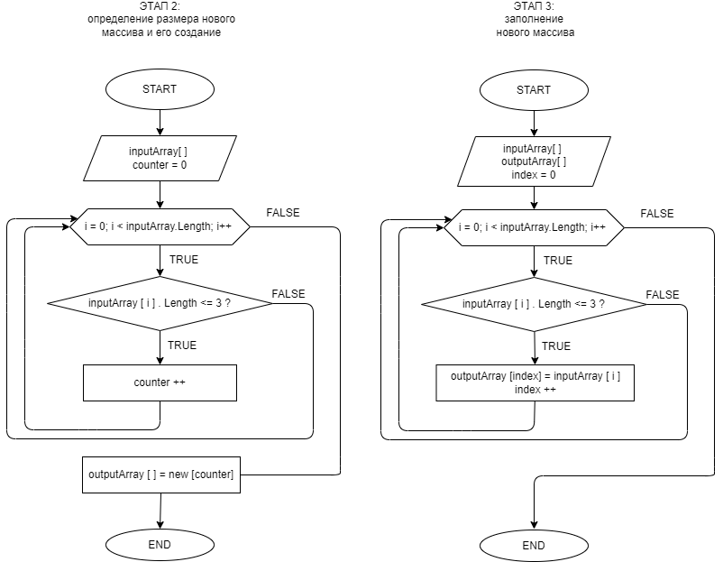

# Контрольная работа #1

## Задача

Написать программу, которая из имеющегося массива строк формирует массив из строк, длина которых меньше либо равна 3 символа. Первоначальный массив можно ввести с клавиатуры, либо задать на старте выполнения алгоритма. При решении не рекомендуется пользоваться коллекциями, лучше обойтись исключительно массивами.

**Примеры**:

["hello", "2", "world", ":-)"] -> ["2", ":-)"]

["1234", "1567", "-2", "computer science"] -> ["-2"]

["Russia", "Denmark", "Kazan"] -> []

## Решение
### Декомпозиция задачи
Для решения задачи я выделила следующие блоки:
1. **Ввод исходного массива.** Пусть он будет задан на старте выполнения алгоритма, как предложено в условиях задачи.
2. **Определение размера нового массива и его создание.** Для этого подсчитаем в исходном массиве количество элементов, удовлетворяющих условию поиска (длина <= 3). Как результат, создадим новый массив с длиной, равной кол-ву найденных элементов.
3. **Заполнение нового массива.** Заполним новый массив элементами исходного, удовлетворяющими условиям поиска (длина <= 3).
4. **Выведение в терминал исходного и нового массивов.** Выведем в терминал оба массива - так результат выполнения кода будет более нагляден.

### Блок-схемы
Предлагаемый алгоритм решения **второго** и **третьего этапов задачи** визуализирован в блок-схеме:

### Решение задачи

Полный код решения задачи приведен в [файле](Program.cs) 